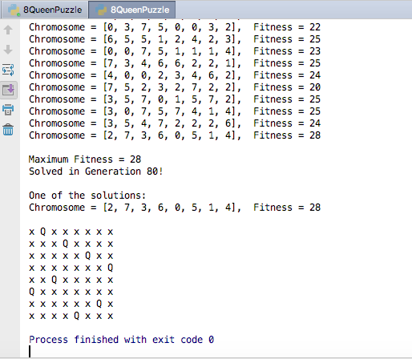

# Genetic Algorithm - 8 Queens Problem

The eight queens puzzle is the problem of placing eight chess queens on an 8×8 chessboard so that no two queens threaten each other; thus, a solution requires that no two queens share the same row, column, or diagonal. The eight queens puzzle is an example of the more general n queens problem of placing n non-attacking queens on an n×n chessboard. (Source : https://en.wikipedia.org/wiki/Eight_queens_puzzle )

Challenge
The challenge is to generate one right sequence through Genetic Programming. The sequence has to be 8 numbers between 0 to 7. Each number represents the positions the Queens can be placed. Each number refers to the row number in the specific column

0 3 4 5 6 1 2 4

- 0 is the row number in the column 0 where the Queen can be placed

- 3 is the row number in the column 1 where the Queen can be placed

## Below Steps - for the algorithm
1. A random population is created for solutions and then a fitness scores of each element are scored. They are 
ranked based on the sorted values obtained from their fitness score.
2. Based on the better indivuduals based on scoring in population they will be passed on next generation.
3. They will be selected as parents for the crossover function to create new offsprings, and their fitness score will be calculated.
4. Based on a mutation probability, a mutation operator is applied on new offsprigs which randomly
changes few elemenst. Mutation probability is important part for converging to the optimal solutions.
5. Evaluated process is carried out make sure on the sequence or pattern is acheived.

## Outcome Screenhot - 

